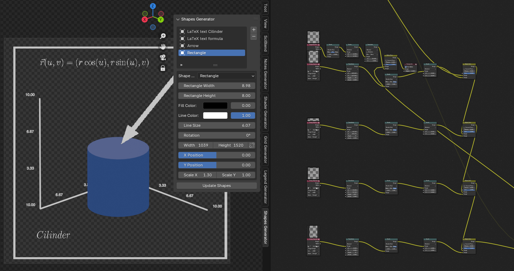

# Shapes Generator for Blender v1.0.0

This add-on for Blender 4.2 allows users to create and overlay various shapes onto their renders in real-time using Blender's compositor. It's particularly useful for adding annotations, highlights, or graphical elements to your Blender renders, making it an essential tool for scientific visualization, technical illustrations, and educational content creation.



## Table of Contents

1. [Requirements](#requirements)
2. [Features](#features)
3. [Installation](#installation)
   - [Important Note: Blender Installation](#important-note-blender-installation)
   - [Install Blender 4.2](#1-install-blender-42)
   - [Install `matplotlib`](#2-install-matplotlib)
   - [Install the Add-on](#3-install-the-add-on)
4. [Usage](#usage)
   - [Accessing the Shapes Generator Panel](#1-accessing-the-shapes-generator-panel)
   - [Adding and Configuring Shapes](#2-adding-and-configuring-shapes)
   - [Customizing Shape Appearance](#3-customizing-shape-appearance)
   - [Generating and Updating Shapes](#4-generating-and-updating-shapes)
   - [Integrating Shapes into Your Render](#5-integrating-shapes-into-your-render)
5. [Advanced Features](#advanced-features)
   - [LaTeX Support](#latex-support)
   - [Custom Shape Import](#custom-shape-import)
6. [Troubleshooting](#troubleshooting)
7. [Contributing](#contributing)
8. [License](#license)

## Requirements

Before installing Blender and the add-on, ensure that you meet the following requirements:

1. **Operating System**: 
    - Linux (any recent distribution)
  
2. **Blender**:
    - Blender 4.2 or higher

3. **Python**:
    - Python 3.11 (bundled with Blender 4.2)

4. **Disk Space**:
    - At least 1 GB of free disk space for Blender installation and dependencies.

5. **Internet Connection**:
    - Required to download Blender, `matplotlib`, and other dependencies.
    
## Features

- Generate and overlay various shapes:
  - Arrows (simple and fancy)
  - Circles
  - Rectangles
  - Ellipses
  - Text
- Support for LaTeX formulas
- Import custom shapes (PNG images)
- Customize fill color, line color, size, and position of each shape
- Adjust rotation and scale of shapes
- Real-time updates in the compositor view
- Intuitive user interface in Blender's sidebar

## Installation

### Important Note: Blender Installation

**IMPORTANT**: When installing Blender, it is crucial to avoid using the Snap package version. The Snap version of Blender creates an isolated environment that prevents the installation of additional Python packages like `matplotlib`, which is essential for this add-on to function correctly.

Instead, please follow the manual installation instructions provided below to ensure that you can properly install and use all required dependencies.

### 1. Install Blender 4.2

To use this add-on, you need to have Blender 4.2 installed. Follow these steps to install Blender:

1. **Download Blender 4.2**:
    - Go to the official Blender website: [Blender Download](https://www.blender.org/download/).
    - Download the Blender 4.2 version for Linux (as a `.tar.xz` file).

2. **Extract Blender**:
    - Open a terminal and navigate to your Downloads directory:
      ```bash
      cd ~/Downloads
      ```
    - Create a directory for Blender and extract the downloaded file:
      ```bash
      sudo mkdir -p /opt/blender
      sudo tar -xvf blender-4.2-linux-x64.tar.xz -C /opt/blender/
      ```
    - Change the ownership of the Blender directory:
      ```bash
      sudo chown -R $USER:$USER /opt/blender
      ```

3. **Create a Symlink for Easy Access**:
    - Create a symbolic link to easily run Blender from the terminal:
      ```bash
      sudo ln -s /opt/blender/blender-4.2-linux-x64/blender /usr/local/bin/blender
      ```
    - Now you can run Blender simply by typing `blender` in your terminal.

### 2. Install `matplotlib`

To ensure the add-on functions correctly, you need to install `matplotlib` in Blender's Python environment:

1. **Ensure `pip` is Available**:
    - Run the following command to ensure `pip` is installed in Blender's Python environment:
      ```bash
      /opt/blender/blender-4.2-linux-x64/4.2/python/bin/python3.11 -m ensurepip
      ```

2. **Install `matplotlib`**:
    - Install `matplotlib` using `pip` within Blender's Python environment:
      ```bash
      /opt/blender/blender-4.2-linux-x64/4.2/python/bin/python3.11 -m pip install --target=/opt/blender/blender-4.2.1-linux-x64/4.2/python/lib/python3.11/site-packages matplotlib
      ```
    - If you encounter warnings about existing directories or package conflicts, you can use the `--upgrade` option to ensure all packages are correctly installed:
      ```bash
      /opt/blender/blender-4.2-linux-x64/4.2/python/bin/python3.11 -m pip install --target=/opt/blender/blender-4.2.1-linux-x64/4.2/python/lib/python3.11/site-packages --upgrade matplotlib
      ```

### 3. Install the Add-on

1. **Package the Script**:
    - Place the provided script files into a folder named `Shapes Generator`.

2. **Install the Add-on in Blender**:
    - Open Blender and go to `Edit > Preferences > Add-ons`.
    - Click on `Install...` and select the `Shapes Generator` folder.
    - Enable the add-on by checking the box next to `Shapes Generator`.

3. **Using the Add-on**:
    - Access the add-on from the `View3D` panel under the `Shapes Generator` tab.
    - Configure your shapes and add them to your composition.

## Usage

Once the add-on is installed and enabled, you can use it to generate and customize shapes in Blender. Here's a step-by-step guide on how to use the add-on:

### 1. Accessing the Shapes Generator Panel

- Open Blender and switch to the 3D Viewport.
- In the right sidebar (N), you will see a new tab called "Shapes Generator".
- Click on this tab to access the add-on's UI panel.

### 2. Adding and Configuring Shapes

- Use the "+" button to add a new shape.
- Select the shape type from the dropdown menu (Arrow, Circle, Rectangle, Text, etc.).
- Configure shape-specific properties (e.g., arrow length, circle radius).

### 3. Customizing Shape Appearance

- Adjust fill color, line color, and opacity for each shape.
- Set the position, rotation, and scale of the shape.
- For text shapes, enter the content and adjust font properties.
- For custom shapes, import a PNG image.

##### Shape-Specific Sizing Parameters

Depending on the type of shape, there are additional parameters that affect the shape's dimensions during generation:

- **Arrow**: 
  - Arrow Length: Determines the length of the arrow shaft.
  - Arrow Width: Sets the width of the arrow head.
- **Circle**: 
  - Radius: Defines the size of the circle.
- **Rectangle**: 
  - Width and Height: Directly control the rectangle's dimensions.
- **Ellipse**: 
  - Major Axis and Minor Axis: Define the ellipse's shape.

These shape-specific parameters adjust the shape's proportions during generation, before any additional scaling is applied in the composition.
#### Shape Sizing and Scaling

The Shapes Generator provides fine-grained control over the size and scale of each shape through several parameters:

##### Width and Height

- **Width**: Defines the initial width of the shape in pixels.
- **Height**: Defines the initial height of the shape in pixels.

These parameters set the base dimensions of the shape before any scaling is applied. They determine the resolution and aspect ratio of the generated shape image.

##### Scale X and Scale Y

- **Scale X**: Adjusts the horizontal scale of the shape relative to its initial width.
- **Scale Y**: Adjusts the vertical scale of the shape relative to its initial height.

The scale parameters allow you to resize the shape after it has been generated, without changing its base resolution. This is useful for fine-tuning the shape's size in your composition.


##### How They Work Together

1. The shape is initially generated using its specific sizing parameters (e.g., arrow length, circle radius).
2. The generated shape is then placed within the canvas defined by Width and Height.
3. Finally, Scale X and Scale Y are applied to adjust the shape's size in the composition.

For example:
- For an arrow with Length = 80, Width = 20, canvas Width = 100, Height = 100, Scale X = 2, and Scale Y = 1:
  - The arrow is generated with an 80-pixel shaft and 20-pixel wide head.
  - It's placed on a 100x100 pixel canvas.
  - In the final composition, it appears 200 pixels wide (due to Scale X = 2) and 100 pixels tall.

This multi-step sizing process allows for precise control over both the shape's intrinsic proportions and its final appearance in the composition.

### 4. Generating and Updating Shapes

- After configuring your shapes, click the "Update Shapes" button.
- The shapes will be generated and added to your compositor setup.

### 5. Integrating Shapes into Your Render

- The generated shapes will automatically be integrated into your render through Blender's compositor.
- You can further adjust the position and scale of shapes using the controls in the Shapes Generator panel.

## Advanced Features

### LaTeX Support

The Shapes Generator supports rendering LaTeX formulas:

1. Choose "LaTeX" as the shape type.
2. Enter your LaTeX formula in the "LaTeX Formula" field.
3. Customize font color and size as needed.

### Custom Shape Import

You can import custom shapes as PNG images:

1. Choose "Custom" as the shape type.
2. Click "Import Custom Shape" and select your PNG file.
3. Adjust the imported shape's properties like any other shape.

## Troubleshooting

- If shapes are not appearing, ensure that your scene is set up to use the Compositor.
- For LaTeX rendering issues, verify that `matplotlib` is correctly installed in Blender's Python environment.
- If custom shapes are not importing, check that the file is a valid PNG image.

## Contributing

Contributions to the Shapes Generator add-on are welcome! If you'd like to contribute:

1. Fork the repository.
2. Create a new branch for your feature or bug fix.
3. Commit your changes with clear, descriptive messages.
4. Push your branch and submit a pull request.

Please ensure your code adheres to the existing style and includes appropriate tests and documentation.

## License

This project is licensed under the GNU General Public License v3.0. See the [LICENSE](LICENSE) file for details.
